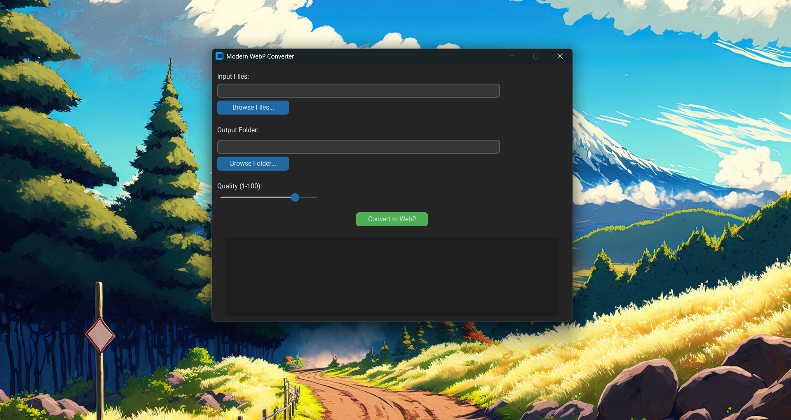

# 🖼️ WebP Converter

A simple desktop app built with **Python**, **Pillow**, and **CustomTkinter** that converts common image formats into modern **WebP** format with adjustable quality.  



---

## ✨ Features
- Convert **JPG, JPEG, PNG, BMP, TIFF** images to **WebP**  
- Select **multiple files** at once  
- Adjustable **compression quality (1–100)**  
- Modern **dark/light theme UI** (via CustomTkinter)  
- Conversion log for each file  
- Portable **Windows `.exe` build** (no Python required)

---

## 📦 Installation

### Option 1: Run from Source
Clone the repo and install dependencies:
```bash
git clone https://github.com/Ace0731/Image_Converter.git
cd webp-converter
python -m pip install -r requirements.txt
python webp_converter.py
