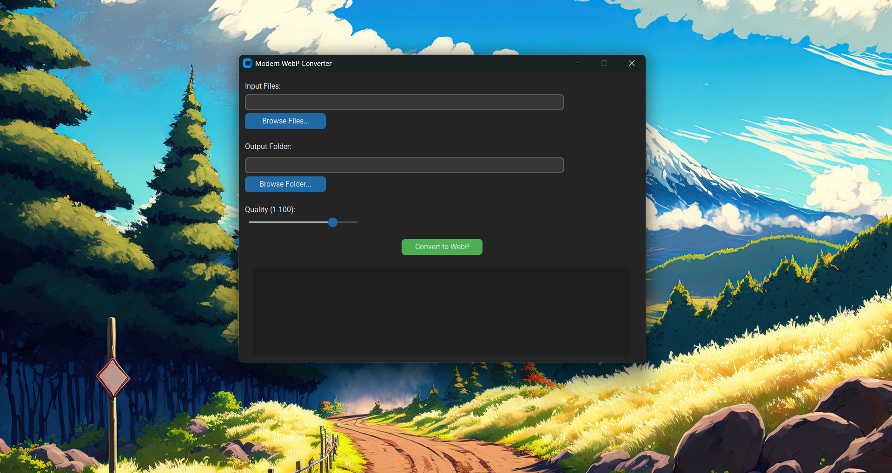
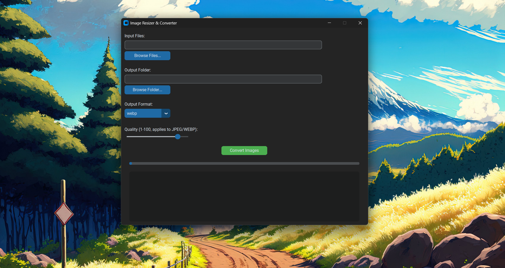

# 🖼️ Shrinkify – Full HD Image Resizer & Converter

A simple desktop app built with **Python**, **Pillow**, and **CustomTkinter** that resizes images to **Full HD (1920×1080 max)** and converts them to modern formats like **WebP, JPEG, or PNG** with adjustable quality.  

  


---

## ✨ Features
- Resize any image automatically to **Full HD (1920×1080 max)**  
- Convert **JPG, JPEG, PNG, BMP, TIFF, WEBP, GIF** and more  
- Select **multiple files** at once  
- Choose **output format**: WebP, JPEG, or PNG  
- Adjustable **compression quality (1–100)** for JPEG & WebP  
- Modern **dark/light theme UI** (via CustomTkinter)  
- Conversion log with before/after sizes  
- Portable **Windows `.exe` build** (no Python required)

---

## 📦 Installation

### Option 1: Run from Source
Clone the repo and install dependencies:
```bash
git clone https://github.com/Ace0731/Image_Converter.git
cd Image_Converter
python -m pip install -r requirements.txt
python shrinkify.py
